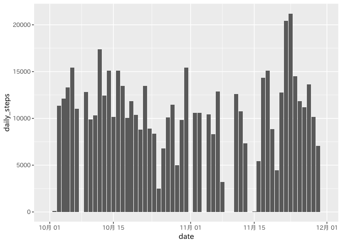
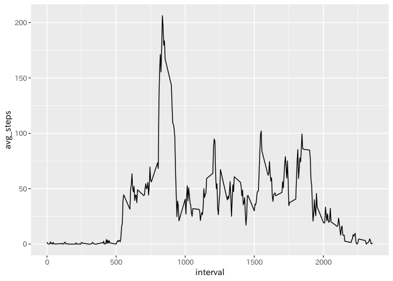
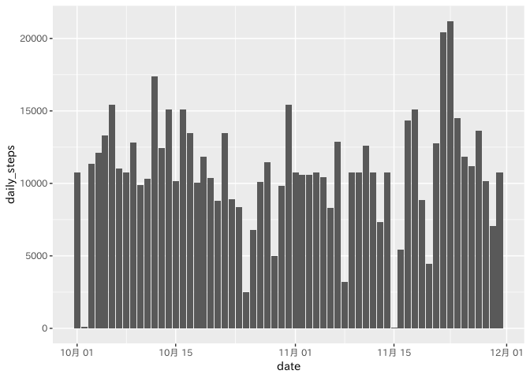
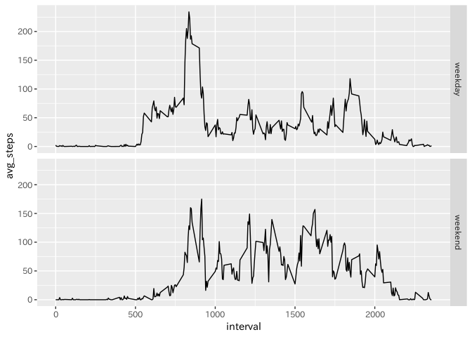

## Library

```r
suppressMessages(library(knitr))
suppressMessages(library(dplyr))
suppressMessages(library(ggplot2))
suppressMessages(library(lubridate))
```

## Set option

```r
opts_chunk$set(echo = TRUE)
```

## Loading and preprocessing the data

```r
d <- read.table(
    unz("activity.zip", "activity.csv"),
    header = TRUE,
    sep = ",",
    colClasses = c("numeric", "Date", "numeric"),
    na.strings = "NA"
)
```

## What is mean total number of steps taken per day?

```r
total <- d %>%
    group_by(date) %>%
    summarize(daily_steps = sum(steps, na.rm = TRUE))
p <- ggplot(total, aes(x = date, y = daily_steps)) + geom_bar(stat = "identity")
plot(p)
```

<!-- -->

```r
mean(total$daily_steps)
```

```
## [1] 9354.23
```

```r
median(total$daily_steps)
```

```
## [1] 10395
```

## What is the average daily activity pattern?

```r
mean <- d %>%
  group_by(interval) %>%
  summarize(avg_steps = mean(steps, na.rm = TRUE))
p <- ggplot(mean, aes(x = interval, y = avg_steps)) + geom_line()
plot(p)
```

<!-- -->

```r
max(mean$avg_steps, na.rm = TRUE)
```

```
## [1] 206.1698
```


## Imputing missing values

```r
sum(is.na(d$steps))
```

```
## [1] 2304
```

```r
d <- d %>%
  mutate(filled_steps = ifelse(is.na(steps), mean(d$steps, na.rm = TRUE), steps))
filled_total <- d %>%
    group_by(date) %>%
    summarize(daily_steps = sum(filled_steps, na.rm = TRUE))
p <- ggplot(filled_total, aes(x = date, y = daily_steps)) + geom_bar(stat = "identity")
plot(p)
```

<!-- -->

```r
mean(filled_total$daily_steps)
```

```
## [1] 10766.19
```

```r
median(filled_total$daily_steps)
```

```
## [1] 10766.19
```


## Are there differences in activity patterns between weekdays and weekends?

```r
weekday_mean <- d %>% 
  filter(wday(date) %in% c(2, 3, 4, 5, 6)) %>% 
  group_by(interval) %>% 
  summarize(avg_steps = mean(steps, na.rm = TRUE)) %>% 
  mutate(category = "weekday")
weekend_mean <- d %>% 
  filter(wday(date) %in% c(1, 7)) %>% 
  group_by(interval) %>% 
  summarize(avg_steps = mean(steps, na.rm = TRUE)) %>% 
  mutate(category = "weekend")
mean <- rbind(weekday_mean, weekend_mean)
p <- ggplot(mean, aes(x = interval, y = avg_steps)) + geom_line() + facet_grid(vars(category))
plot(p)
```

<!-- -->
